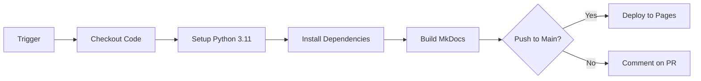

# GitHub Actions Workflows

Complete reference for all automation workflows in Tailwind Luna Theme.

## Deploy MkDocs to GitHub Pages

### Overview

Automatically builds and deploys MkDocs documentation to GitHub Pages on every push to main branch.

**File Location**: `.github/workflows/deploy-mkdocs.yml`

### Trigger Events

The workflow activates on:

- **Push to main/master**: Automatically builds and deploys documentation
- **Pull Requests**: Builds documentation and comments on PR
- **Manual Trigger**: Via `workflow_dispatch` for on-demand builds
- **File Changes**: Only when docs, mkdocs.yml, or this workflow changes

### Workflow Steps



### Jobs Configuration

#### Permissions

The job requires specific GitHub permissions:

```yaml
permissions:
  contents: read         # Read repository contents
  pages: write           # Write to GitHub Pages
  id-token: write        # ID token for authentication
```

#### Environment

- **Runner**: Ubuntu Latest (`ubuntu-latest`)
- **Python Version**: 3.11
- **Dependencies**: Installed from `requirements.txt`

### Builds and Deployment

#### Build Phase

```bash
# Install MkDocs and dependencies
pip install -r requirements.txt

# Build static site
mkdocs build --strict --verbose
```

**Output**: Creates `site/` directory with static HTML

#### Deployment Phase (Main Branch Only)

```yaml
- name: Deploy to GitHub Pages
  if: github.event_name == 'push' && 
      (github.ref == 'refs/heads/main' || 
       github.ref == 'refs/heads/master')
  id: deployment
  uses: actions/deploy-pages@v2
```

**Result**: Publishes to `https://your-org.github.io/tailwind-luna-theme/`

#### Pull Request Phase

Adds a comment confirming documentation build success:

```markdown
✅ **Documentation built successfully!**

The MkDocs site has been generated. Once merged to main, 
it will be published to GitHub Pages.
```

## Repository Setup

### Enable GitHub Pages

1. Go to **Settings** → **Pages**
2. Set **Source** to "GitHub Actions"
3. **Build and deployment** auto-selected
4. Documentation will deploy to `https://your-org.github.io/tailwind-luna-theme/`

### Configure Deployment Secrets (Optional)

If using custom authentication:

1. Go to **Settings** → **Secrets and variables** → **Actions**
2. Add custom secrets if needed (usually not required)

## Monitoring Deployments

### View Workflow Runs

1. Go to **Actions** tab
2. Select **Deploy MkDocs to GitHub Pages**
3. Check latest runs

### Artifact Inspection

```bash
# Download artifact from failed build
# Go to Actions → Run → Artifacts section
# Download "github-pages" artifact
```

### Troubleshooting Failed Builds

**Check Workflow Logs**:
1. Actions tab → Workflow run → Job logs
2. Look for error messages in "Build MkDocs site" step

**Common Issues**:

| Error | Cause | Solution |
|-------|-------|----------|
| `No such file: requirements.txt` | Missing dependencies file | Create `requirements.txt` in repo root |
| `Build FAILED` | Invalid YAML in mkdocs.yml | Validate with `mkdocs serve` locally |
| `import error: pymdownx` | Missing Python package | Add to `requirements.txt` |

## Configuration Reference

### Trigger Paths

```yaml
paths:
  - 'docs/**'              # Documentation changes
  - 'mkdocs.yml'           # Config changes
  - 'requirements.txt'     # Dependency changes
  - '.github/workflows/deploy-mkdocs.yml'  # Workflow changes
```

Workflow only runs when these files/directories change.

### Python Cache

```yaml
- uses: actions/setup-python@v4
  with:
    cache: 'pip'  # Cache pip dependencies for faster builds
```

Speeds up subsequent builds by ~60%.

### Strict Mode

```bash
mkdocs build --strict --verbose
```

- `--strict`: Fail build on warnings
- `--verbose`: Show detailed build output

## Local Testing

### Test Locally Before Pushing

```bash
# Install dependencies
pip install -r requirements.txt

# Serve documentation locally
mkdocs serve

# Open browser to http://localhost:8000
```

### Build Static Site

```bash
# Build production site
mkdocs build

# Output in ./site directory
# Test with: python -m http.server 8000 -d site
```

## Best Practices

### Documentation Updates

1. **Edit locally**: Update `.md` files in `docs/` directory
2. **Test locally**: Run `mkdocs serve` to preview
3. **Commit changes**: `git commit -am "Update documentation"`
4. **Push to main**: Triggers automatic deployment

### Workflow Maintenance

- Keep `requirements.txt` updated with latest versions
- Test major Python upgrades locally first
- Review workflow logs after each deployment
- Update mkdocs.yml when adding new sections

### Performance Optimization

- Use Material theme with minimal custom CSS
- Optimize images before adding to docs
- Cache dependencies with `actions/setup-python@v4`
- Minimize Python package dependencies

## Schedule-Based Deployments

### Optional: Daily Rebuild

Add to `.github/workflows/deploy-mkdocs.yml`:

```yaml
on:
  schedule:
    - cron: '0 0 * * *'  # Daily at midnight UTC
```

Useful for:
- Auto-updating generated documentation
- Testing workflow stability
- Refreshing cached pages

---

Next: [Deployment Guide](deployment.md) | Reference: [Workflows](workflows.md)
